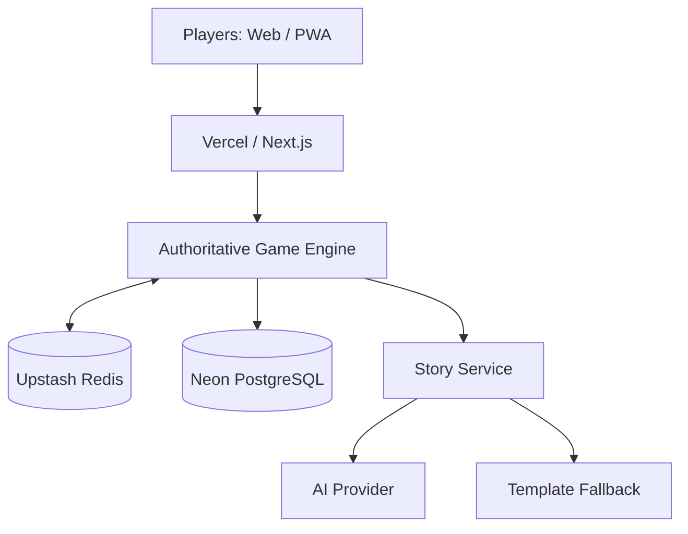
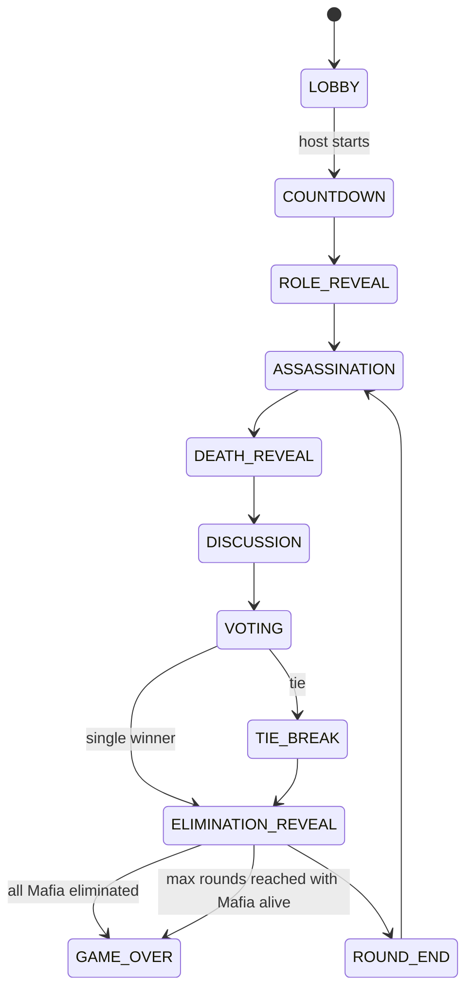
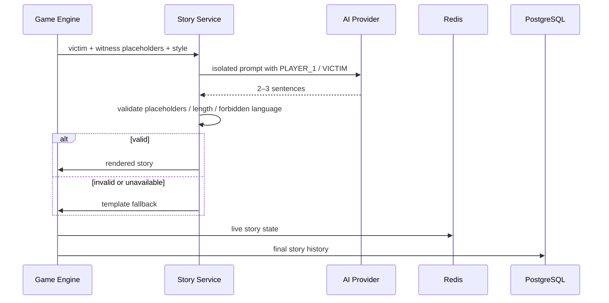

# Mafia Night — Architecture Notes



## Runtime state

```text
mafia:room:{roomId}
mafia:session:{sessionId}
mafia:roomcode:{ROOMCODE} -> roomId
mafia:lock:{roomId}
```

## State machine



## Privacy model

```text
Public snapshot:
  player id/name/avatar/status/connection/host

Private snapshot for self:
  own role
  connected Mafia teammates if applicable
  own task
  own vote state

Game over:
  all roles
```

Dead players remain connected to the match but cannot perform live actions.

## Story pipeline



## Database boundary

Redis is for ephemeral live state. PostgreSQL is for durable match history. Do not persist timer ticks. Store phase start/end timestamps.
