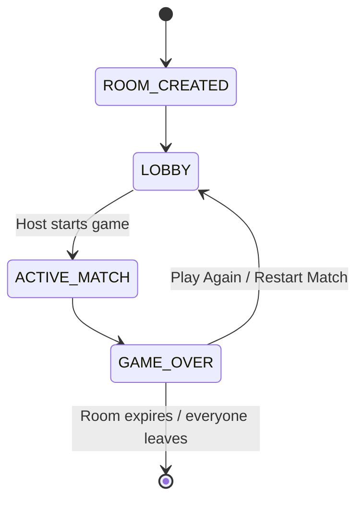
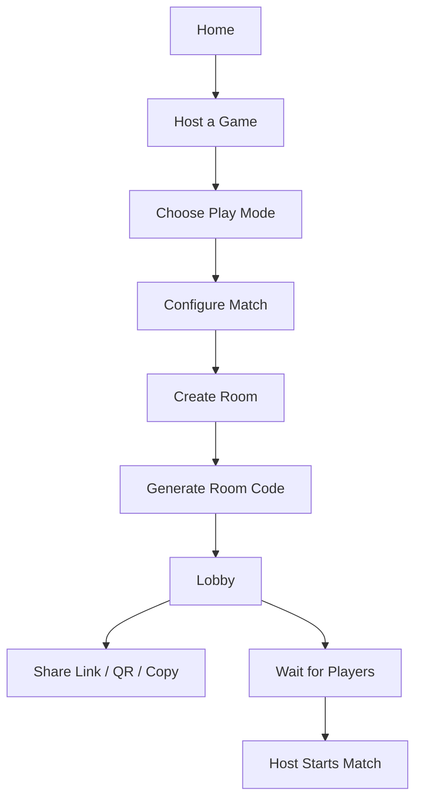
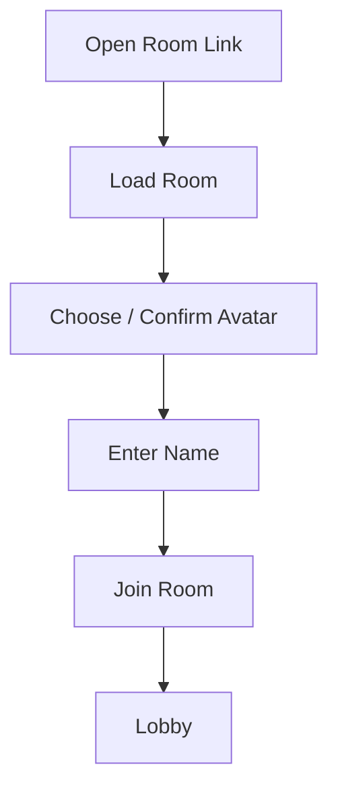
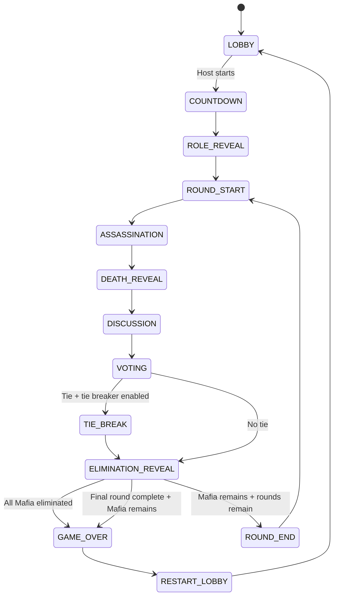
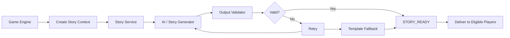
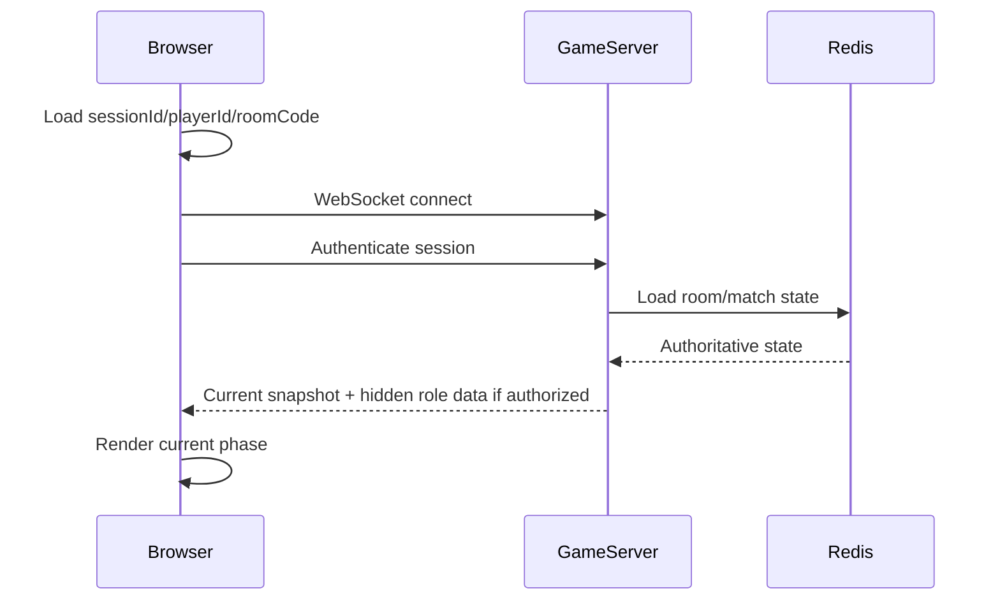
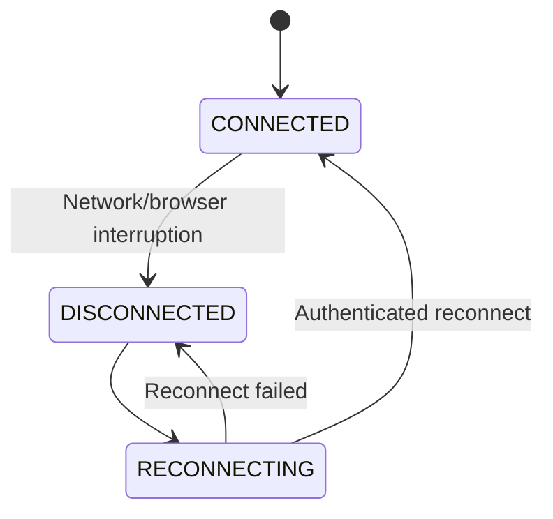
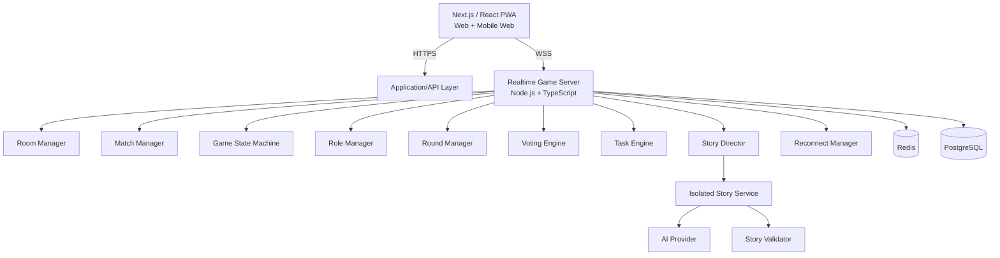
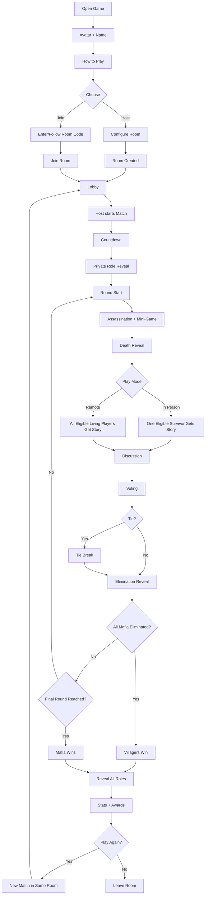

# Mafia Game — Complete Product & Technical Specification

**Project:** Multiplayer Social-Deduction Mafia Game  
**Document type:** Product + UX + Game Rules + Technical Architecture + Implementation Plan  
**Version:** v1.0 — Full Concept Baseline  
**Status:** Ready to begin implementation

---

## 1. Product Vision

This project is a real-time multiplayer Mafia/social-deduction game designed for groups of friends. It should feel like a **proper polished game**, not a basic web form or a simple Mafia clone.

The core experience combines:

1. **Hidden-role Mafia gameplay** — players secretly receive Mafia/Villager roles.
2. **Interactive mini-games** — every player gets a task during the assassination phase.
3. **Cinematic death reveals** — suspense, sound, red/green feedback, and a short AI-generated story.
4. **Flexible social play** — support both people playing together in one physical place and people playing remotely.
5. **Replayability** — different roles, different task games, different stories, configurable rounds, and post-game statistics.
6. **Strong reconnect behavior** — refreshing, closing a browser, reconnecting, or temporarily losing the network must not destroy the match.
7. **Server-authoritative multiplayer** — the browser is a client, not the source of truth.

The intended emotional experience is:

> **Suspense → chaos → laughter → suspicion → reveal → replay**

---

# 2. Core Product Identity

## 2.1 Game Structure

The product has two major concepts:

### Room

A persistent game-night container identified by a room code.

Example:

```text
M7K92Q
```

A room can host multiple matches over time.

### Match

One actual Mafia game played inside a room.

Example:

```text
MATCH-001
MATCH-002
MATCH-003
```

This distinction is critical because **Restart Match must create a new Match without destroying the Room**.

---

## 2.2 Room Lifecycle



The room is not tied to a browser tab. The host closing Chrome must not destroy the room.

---

# 3. Supported Player Count

- Minimum players to start: **4**
- Maximum players: **25**
- Host chooses max capacity when configuring the room.
- The actual match starts only with players currently in the room.
- Dead/eliminated players remain associated with the Match as spectators.

### Configuration validation

The server must prevent obviously invalid Mafia configurations.

Example recommendation:

- 4–7 players → 1 Mafia
- 8+ players → 1–2 Mafia depending on host selection
- Do not allow Mafia count to equal or exceed the valid non-Mafia population at game start.

The exact scaling can remain configurable, but the server must validate it before the Match starts.

---

# 4. Host Configuration

The host configures the Match before starting it.

## 4.1 Basic Settings

### Maximum Players

```text
4–25
```

### Number of Imposters

```text
Auto
1
2
```

Future expansion may add 3.

### Mafia Mode

```text
Blind Mafia
Connected Mafia
```

#### Blind Mafia

Mafia players do not know who the other Mafia players are.

#### Connected Mafia

Mafia players know the identities of their Mafia teammates.

### Number of Rounds

```text
Minimum: 1
Maximum: 8
Recommended default: 4
```

The Match is fundamentally **round-based**.

### Play Mode

```text
In Person
Remote
```

This determines how the death story is delivered.

---

## 4.2 Advanced Settings

Recommended settings exposed under an **Advanced Settings** section:

```text
Assassination Time
Task Time
Discussion Time
Voting Time
Votes Per Player
Allow Vote Change / Revote
Tie Breaker
Failed Kill Behavior
Story Mode / Story Speed
Task Difficulty
```

### Suggested initial defaults

| Setting | Default |
|---|---:|
| Max players | 10 or host-selected |
| Imposters | 1 |
| Mafia mode | Connected or host-selected |
| Rounds | 4 |
| Assassination | 15–30 sec |
| Task | 30–60 sec |
| Discussion | 30 sec |
| Voting | 30 sec |
| Votes/player | 1 |
| Revote | On/Off by host |
| Tie-break | On |
| Failed kill | No Kill |
| Failed vote | No Vote |
| Story | On |

---

# 5. Role Assignment & Fairness

Roles are assigned **once per Match**, not per round.

The game has:

- Mafia / Imposter
- Villager

## 5.1 Fair role assignment

The same player should not feel like they are repeatedly selected as Mafia while other players never get the role.

Use **soft fairness**, not a predictable hard rotation.

### Recommended approach

1. Track Mafia history across previous Matches in the same Room.
2. Give players who have recently been Mafia a lower selection weight.
3. Give players who have rarely/never been Mafia a higher weight.
4. Perform the final selection using secure server-side randomness.
5. Shuffle the final role assignment before sending it.
6. Never derive role from player order, seat position, join time, name, or client randomness.

Do **not** use a rule such as:

> “John cannot be Mafia twice in a row.”

That becomes predictable and therefore exploitable.

The goal is:

> statistically fair over repeated Matches, but still unpredictable every Match.

## 5.2 Randomness

Role assignment, story-reader selection, and tie-break randomness must be generated server-side using a secure random source.

The browser must never use `Math.random()` for game-critical decisions.

---

# 6. Player Identity & Session Handling

Players can initially be guest players; no account is required for the core game.

A browser session should retain only non-secret identifiers such as:

```text
sessionId
playerId
roomCode
```

**Never store the player's role in localStorage.**

The client should reconstruct the game from the server after refresh.

## 6.1 Recommended session hierarchy

```text
User Identity (optional)
        ↓
Player Session
        ↓
Room Membership
        ↓
Match Participation
        ↓
Round State
```

---

# 7. Join & First-Time User Flow

## 7.1 First Visit

The first visit should be extremely simple.

### Step 1 — Avatar

Choose an avatar/profile image.

### Step 2 — Name

Enter display name.

### Step 3 — How to Play

Show a short 4-step card-based onboarding.

Example:

```text
1. 🎭 Get a secret role
2. 🎮 Complete your task
3. 🕵️ Find the Mafia
4. 🗳️ Vote before they survive the final round
```

Controls:

```text
Previous | Next | Skip
```

This onboarding should not appear repeatedly once completed on the device, unless the user chooses to view it again.

---

# 8. Main Entry Screen

Suggested layout:

```text
┌───────────────────────────────────┐
│                                   │
│             MAFIA                 │
│       dark cinematic logo         │
│                                   │
│      [ Avatar + Name ]            │
│                                   │
│     [ HOST A GAME ]               │
│     [ JOIN A GAME ]               │
│                                   │
│       How to Play                 │
│                                   │
└───────────────────────────────────┘
```

Visual direction:

- premium dark/black
- cinematic suspense
- subtle neon accents
- high-quality motion
- strong typography
- no clutter

---

# 9. Create Room Flow



A room gets a human-friendly code.

Example:

```text
M7K92Q
```

Recommended URL format:

```text
https://<domain>/room/M7K92Q
```

or:

```text
https://<domain>/r/M7K92Q
```

A **Copy Link** and native share action should be available.

---

# 10. Join Room Flow



Join should be fast and require minimal typing.

---

# 11. Lobby UX

The lobby should feel like a game lobby rather than a web admin panel.

## 11.1 Lobby contents

- Room code
- Copy link
- Share button
- Player cards
- Avatar
- Name
- Host crown/badge
- Connection status
- Host controls
- Match settings summary
- Start Game button

Example:

```text
┌─────────────────────────────────────────────────┐
│ M7K92Q                             [Share] [Copy] │
│                                                 │
│                PLAYERS                          │
│                                                 │
│  👑 John      Sara       Basil       Arathy      │
│                                                 │
│  Ibn         Dev        Betti       ...         │
│                                                 │
│  ─────────────────────────────────────────────  │
│  Rounds: 4    Mafia: 1    Mode: Connected       │
│                                                 │
│                    [ START GAME ]               │
└─────────────────────────────────────────────────┘
```

Player list should scroll smoothly when the room gets large.

## 11.2 Host Kick

The host may kick players **only while in the lobby**.

No kicking during an active Match.

---

# 12. Host Disconnect & Host Migration

The room must survive a host browser close.

If the host disconnects:

1. Room remains alive on the server.
2. Match continues if already active.
3. During the lobby, another appropriate player becomes host.
4. When the original host reconnects, they return as a player.
5. They do not automatically take host status back if host migration already occurred.

The room is server-side, not browser-tab-side.

---

# 13. Match State Machine

The core game engine should be an explicit state machine.



Connection state is **not** a game phase.

Connection state is separate:

```text
CONNECTED
DISCONNECTED
RECONNECTING
CONNECTED
```

---

# 14. Match Start

When the host starts:

### Phase 1 — Countdown

```text
3
2
1
```

Use sound + animation.

### Phase 2 — Role Reveal

Each player receives their own private role.

### Role UI

Mafia:

```text
YOU ARE THE MAFIA
☠
```

Villager:

```text
YOU ARE A VILLAGER
🕵️
```

In Connected Mafia mode, Mafia players also receive teammate identities.

In Blind Mafia mode, they do not.

---

# 15. Round Structure

Each round follows this sequence:

```text
ROUND START
    ↓
ASSASSINATION + TASK
    ↓
DEATH REVEAL
    ↓
AI STORY
    ↓
DISCUSSION
    ↓
VOTING
    ↓
TIE BREAK (if needed)
    ↓
ELIMINATION REVEAL
    ↓
WIN CHECK
    ↓
NEXT ROUND or GAME OVER
```

---

# 16. Assassination Phase

During the Mafia phase:

- Mafia players get a configurable timer.
- Mafia selects a living target other than themselves.
- The game continues until the configured assassination timer ends.
- Selecting a target early does **not** immediately end the phase.
- This preserves the full task window for everyone.

## Multiple Connected Mafia

Connected Mafia players operate as one Mafia team.

Recommended implementation:

- Each Mafia player can see teammate identity.
- A target selected by one team member becomes the team's selected target.
- Duplicate/conflicting selections resolve through deterministic server rules.
- Only one kill occurs per assassination phase unless future rules explicitly introduce more.

## No target selected

Default:

```text
NO KILL
```

Optional host setting:

```text
RANDOM KILL
```

The server decides the outcome when the timer expires.

---

# 17. Tasks / Mini-Games

Every living player gets **one task per round**.

The task library should contain 5–6 launch games, with room for expansion.

## Launch library

### 1. Pop Rush

Tap moving circles/targets before time runs out.

### 2. Heartbeat

A timing/reaction game where the player must hit the action at the correct moment.

### 3. Memory Flash

Watch a short sequence and reproduce it.

### 4. Wire Panic

Connect matching wires before the timer expires.

### 5. Safe Cracker

Remember and enter a short combination.

### 6. Suspect

Spot the changed object/avatar/details among otherwise similar options.

## Future mini-games

Potential additions:

- Don’t Touch Red
- Evidence Sort
- Lightning Tap
- Hidden Object

The library should be modular so new mini-games can be added without rewriting the game engine.

---

# 18. Task Rotation Rules

Tasks should not become repetitive.

Requirements:

1. Each player receives one task per round.
2. If they finish early, they **do not** receive another task.
3. They see:

```text
TASK COMPLETE
Waiting for the night to end...
```

4. Do not reveal live completion status to other players.
5. Do not reveal live task scores to other players.
6. Rotate tasks between rounds.
7. Avoid giving the same player the exact same task repeatedly.
8. Prefer different task assignments across the whole room when practical.
9. Store per-player task history.

### Example

```text
Round 1 → John: Pop Rush
Round 2 → John: Memory Flash
Round 3 → John: Wire Panic
Round 4 → John: Suspect
```

Selection logic:

```text
availableGames = allGames - recentGamesForPlayer
```

Use secure randomness among eligible games.

---

# 19. Task Data

Each task should record data needed for post-game statistics.

Example:

```ts
interface TaskResult {
  playerId: string;
  matchId: string;
  round: number;
  gameId: string;
  startedAt: number;
  completedAt?: number;
  durationMs?: number;
  completed: boolean;
  score?: number;
  accuracy?: number;
}
```

Task performance should remain hidden until the Match ends.

---

# 20. Death / Assassination Reveal

At the end of the assassination phase, the game enters a cinematic reveal.

## 20.1 Sound

Use:

- heartbeat
- suspense rise
- alarm/danger sound
- reveal sound

Audio should be preloaded locally or from an owned asset pipeline. Do not make game progression depend on remote audio loading.

Browsers may block autoplay, so provide an initial user gesture such as:

```text
[ ENABLE SOUND ]
```

and gracefully support muted mode.

---

# 21. Death Screen

Victim sees:

```text
RED / DANGER STATE

☠

YOU ARE DEAD

You can no longer vote or play tasks.
```

Victim becomes a spectator for the rest of the Match.

They cannot:

- vote
- complete future tasks
- influence game state
- perform Mafia actions

---

# 22. Safe Screen

Everyone else, including Mafia, sees:

```text
GREEN / SAFE STATE

✓

SAVED
```

Then the public game continues.

---

# 23. AI Death Story System

The death story is a **flavor layer only**.

It must never determine:

- who died
- who killed them
- who is Mafia
- who gets eliminated by vote
- whether the round ends

The Game Engine determines all game truth first.

The Story Service only creates narration around those facts.

---

# 24. Story Generation Rules

The AI story must follow strict constraints.

### Required

- 2–3 lines/sentences.
- Suspenseful and playful.
- Suitable for a social party game.
- Use only names from the current room/match.
- Never reveal the killer.
- Never identify or imply the Mafia as the killer.
- Never accuse a player.
- Never invent players.
- Never introduce people from another room.
- Never use outside personal information.
- Do not generate graphic violence.
- Do not change the actual victim.
- Do not invent game results.

---

# 25. Stronger AI Isolation Design

The AI should not receive a global player database or cross-room conversation history.

Bad architecture:

```text
             GLOBAL AI CONTEXT
            /       |        \\
       Room A    Room B    Room C
          ↓         ↓         ↓
             AI Story Engine
```

Correct architecture:

```text
Room A → Match 1 → Round 2 → Story Request A → Story Service
Room B → Match 9 → Round 1 → Story Request B → Story Service
Room C → Match 4 → Round 7 → Story Request C → Story Service
```

Every request is isolated.

---

# 26. Placeholder-Based Story Generation

For maximum safety, the AI should preferably receive placeholders instead of raw names.

Example request:

```json
{
  "roomId": "M7K92Q",
  "matchId": "MATCH-003",
  "round": 2,
  "victimToken": "VICTIM",
  "witnessToken": "PLAYER_1",
  "location": "old shop"
}
```

AI returns:

```text
PLAYER_1 was walking past the old shop when they noticed something strange.
They stepped closer and discovered VICTIM lying motionless nearby.
```

The server then substitutes:

```text
PLAYER_1 → Ibn
VICTIM → Arathy
```

Final story:

> Ibn was walking past the old shop when he noticed something strange. He stepped closer and discovered Arathy lying motionless nearby.

This dramatically reduces accidental name leakage.

---

# 27. Story Validation Pipeline



Validation should check:

- only expected placeholder tokens/names appear
- victim is correct
- no forbidden killer reference is present
- no unknown names are present
- output length is within bounds
- output is safe/non-graphic

If generation fails repeatedly, use deterministic template-based narration.

**The game must never wait indefinitely for AI.**

---

# 28. Story Generation Timing

Do not wait until the assassination timer ends to begin generation.

Start story generation as soon as the Mafia target is locked.

```text
Mafia selects target
        ↓
Story request starts immediately
        ↓
Assassination timer continues
        ↓
AI generates story in background
        ↓
Validate + cache
        ↓
Timer ends
        ↓
Death reveal
        ↓
Story already available
```

If AI is slow/unavailable:

```text
AI story unavailable
        ↓
Template fallback
        ↓
Game continues normally
```

---

# 29. In-Person Story Mode

If:

```text
playMode = IN_PERSON
```

then the story is displayed to **one randomly selected eligible living player**.

The story reader must not be:

- the killer
- the victim
- dead/eliminated

Example:

```text
Players: John, Sara, Basil, Ibn, Arathy, Dev
Killer: Basil
Victim: Arathy

Eligible readers:
John, Sara, Ibn, Dev

Random reader:
Sara
```

Sara's client receives:

```text
YOU ARE THE NARRATOR

READ THIS STORY ALOUD
```

All other players receive only a waiting/suspense UI.

---

# 30. Remote Story Mode

If:

```text
playMode = REMOTE
```

then every eligible living player receives the story on their own screen.

Example:

```text
John  → Story
Sara  → Story
Basil → Story (if alive / eligible)
Ibn   → Story
Arathy → DEAD / no story
Dev   → Story
```

The story is public to the living players in the Match.

---

# 31. Story Context Isolation

Every story request must include a strict scope:

```text
roomId
matchId
roundId
storyId
```

The Story Service must never query unrelated rooms.

Recommended principle:

> **A story request should be able to run correctly even if the story service knows nothing about any other room.**

---

# 32. Discussion Phase

After the death reveal and story:

```text
DISCUSSION
```

Show:

- countdown timer
- public living/dead state
- player avatars
- no hidden roles
- no hidden Mafia actions

Dead players remain spectators.

Recommended initial duration: 30 seconds.

The game does not need built-in voice chat for the first version; the discussion phase can simply provide the timer and player state while friends talk through their preferred communication method. Built-in voice can be added later if desired.

---

# 33. Voting Phase

Living players can vote.

Dead players cannot vote.

Voting configuration:

- votes per player
- revote toggle
- voting timer

## 33.1 No Vote

If the timer expires before a living player submits a vote:

```text
vote = null
```

The vote must **not** carry over.

The game must **not randomly choose a player** for them unless a future host option explicitly changes this.

---

# 34. Vote Change

If the host enabled revote/change vote:

- player can change their vote until the voting timer ends
- only the latest valid vote counts
- the server stores the final vote state

If revote is disabled:

- first valid vote locks the player

All validation happens on the server.

---

# 35. Tie-Break

If multiple candidates have the highest vote count:

```text
Normal Voting
      ↓
Tie detected
      ↓
Only tied candidates remain eligible
      ↓
Non-tied living players vote
      ↓
Tie-break result
```

Exclude from tie-break voting:

- dead players
- tied candidates themselves

Only the remaining eligible living players can select between tied candidates.

## Recommended edge-case rule

If the tie-break itself ends in a tie, default to:

```text
NO ELIMINATION
```

and proceed to the next configured step/round.

This prevents infinite revote loops.

---

# 36. Elimination Reveal

After voting:

Show the poll/result.

Then reveal:

```text
PLAYER ELIMINATED
```

Follow with role reveal.

## If Imposter

```text
🎉 YOU FOUND THE IMPOSTER
```

Use:

- confetti
- clap/celebratory sound
- positive motion

## If Villager

```text
☠ WRONG PERSON
```

Use:

- negative/drowning/death-style reveal
- suspense/failure sound

This is meant to create an emotional reaction without becoming graphic.

---

# 37. Win Conditions

The primary Match boundary is the **host-configured number of rounds**.

Important:

> The game must NOT automatically end simply because the player count drops below four.

## Villager win

If all imposters are eliminated before the configured maximum round:

```text
VILLAGERS WIN
```

## Mafia win

If the maximum configured number of rounds is completed and one or more imposters remain:

```text
MAFIA WINS
```

### Additional recommended validation rule

There is one game-rule decision that should be explicitly locked before implementation: whether the Mafia wins immediately when living Mafia reaches parity with or exceeds living villagers.

Recommended option:

```text
Mafia Parity Rule: ON by default
```

However, because the intended concept emphasizes a fixed-round match rather than player-count termination, this can be exposed as a later/advanced rule. The core implementation should support both without changing the architecture.

---

# 38. Round Progression

Example with 4 configured rounds:

```text
Round 1
  ↓
Death
  ↓
Discussion
  ↓
Vote
  ↓
Elimination
  ↓
Round 2
  ↓
Death
  ↓
Discussion
  ↓
Vote
  ↓
Elimination
  ↓
Round 3
  ↓
...
  ↓
Round 4
  ↓
Final win check
```

If all Mafia are eliminated in Round 2, game ends immediately.

Otherwise continue until the round limit.

---

# 39. Dead Player / Spectator Experience

Once dead, a player remains in the Match but becomes a spectator.

They can see:

- public phase
- timers
- public eliminations
- story where they are eligible to see it
- final result
- post-game stats

They cannot:

- vote
- perform tasks
- kill
- influence game state
- receive information that is hidden from their role/state

Dead-player UX should remain visually distinct but not lock the player out of the overall game screen.

---

# 40. Post-Game Experience

Once the Match ends:

## Phase 1 — Final Reveal

Reveal all remaining/assigned Mafia identities to everyone.

Then show:

```text
MAFIA WINS
```

or:

```text
VILLAGERS WIN
```

Use cinematic animation.

## Phase 2 — Stats

Show a replay-friendly results screen.

---

# 41. Post-Game Statistics

Suggested stats:

### Performance

- Fastest task
- Most accurate task
- Best overall task score
- Most tasks completed

### Detective

- Best detective
- Most correct votes
- Best voter
- Most correct suspicions

### Mafia

- Deadliest Mafia
- Best bluff / master of deception
- Longest surviving Mafia

### Survival / chaos

- Survivor
- Most targeted
- Most votes received
- Most rounds survived
- Most vote changes
- Narrowest escape

These should use fun award-style titles rather than feeling like a school scorecard.

---

# 42. Example Results Screen

```text
┌─────────────────────────────────────────────┐
│               VILLAGERS WON                 │
│                                             │
│  🎭 MAFIA REVEALED                          │
│  Basil                                      │
│                                             │
│  ─────────────────────────────────────────  │
│                                             │
│  🏆 BEST DETECTIVE       Sara               │
│  ⚡ FASTEST TASK         John               │
│  🎯 MOST ACCURATE        Ibn                │
│  🕵️ MASTER OF SUSPICION  Dev                │
│  ☠ MOST TARGETED         Arathy             │
│                                             │
│        [ PLAY AGAIN ]   [ LEAVE ]           │
└─────────────────────────────────────────────┘
```

Make the page screenshot/share friendly.

---

# 43. Restart Match

Restart does **not** create a new Room.

Example:

```text
Room M7K92Q

MATCH-001 → finished
MATCH-002 → new match
```

When host presses:

```text
[ PLAY AGAIN ]
```

server creates a new Match ID.

Players see:

```text
MATCH RESTARTED

The room is ready for another game.

[ REJOIN ]    [ LEAVE ]
```

Host sees:

```text
Players Joined: 7 / 10

[ START NEW MATCH ]
```

Previous Match data remains available for history/statistics.

---

# 44. Refresh / Reconnect Design

Refreshing the page must be safe.

The browser should **not remember a screen** and blindly reconstruct it.

Instead:



The UI always derives itself from authoritative server state.

---

# 45. Reconnection State Machine



The Match continues on the server while a player is disconnected.

---

# 46. Reconnect During Voting

If player had already voted:

```text
existing vote remains valid
```

If player had not voted:

```text
vote remains null
```

When reconnecting:

- if voting is still active and revote is enabled, they can continue/change vote
- if voting is over, the player receives current results/state

---

# 47. Reconnect During Assassination

If Mafia disconnects:

- server keeps the phase running
- player can reconnect
- if a valid target has already been selected, the server preserves that target according to the game rule
- if no target exists when timer expires, default is **No Kill**
- optional setting can allow random kill

Never trust the client's local countdown.

---

# 48. Server-Authoritative Timer Architecture

Every phase should have an absolute server timestamp.

Example:

```json
{
  "phase": "ASSASSINATION",
  "round": 2,
  "endsAt": 1791132000000
}
```

The client simply renders:

```text
remaining = endsAt - currentServerTime
```

The server decides when the phase actually ends.

This prevents users from cheating by modifying browser timers.

---

# 49. Idempotent Game Actions

Every client action should contain a unique `actionId`.

Example:

```json
{
  "actionId": "a_82fd9a",
  "type": "CAST_VOTE",
  "targetPlayerId": "p_183"
}
```

The server stores processed action IDs for the relevant session/phase and ignores duplicate requests.

This prevents accidental double-submits caused by:

- double taps
- lag
- reconnects
- browser retries

---

# 50. State Versioning & Snapshot Recovery

The server should maintain a monotonically increasing state version.

Example:

```json
{
  "stateVersion": 382,
  "phase": "VOTING",
  "round": 3,
  "endsAt": 1791132000000
}
```

Client receives updates:

```text
381 → 382 → 383 → 384
```

If the client reconnects with an outdated version, the server sends a fresh authoritative snapshot.

This is more reliable than expecting every event to be replayed perfectly.

---

# 51. Event Architecture

The game engine should emit explicit events.

Recommended events:

```text
ROOM_CREATED
PLAYER_JOINED
PLAYER_LEFT
PLAYER_RECONNECTED
HOST_MIGRATED
MATCH_CREATED
MATCH_STARTING
ROLE_ASSIGNED
ROUND_STARTED
ASSASSINATION_STARTED
TARGET_SELECTED
ASSASSINATION_ENDED
TASK_STARTED
TASK_COMPLETED
DEATH_REVEAL_STARTED
STORY_REQUESTED
STORY_READY
DISCUSSION_STARTED
VOTING_STARTED
VOTE_CAST
VOTE_CHANGED
VOTING_ENDED
TIE_DETECTED
TIE_VOTE_STARTED
TIE_VOTE_ENDED
PLAYER_ELIMINATED
ROUND_COMPLETE
GAME_WON
GAME_LOST
MATCH_RESTARTED
```

Events are useful for history/debugging, but the authoritative current state must also be stored.

---

# 52. Final Architecture

Recommended production architecture:



---

# 53. Frontend Architecture

Recommended frontend stack:

```text
Next.js
TypeScript
React
Tailwind CSS
Framer Motion
PWA support
WebSocket client
```

Suggested structure:

```text
src/
├── app/
│   ├── page.tsx
│   ├── room/[roomCode]/page.tsx
│   └── match/[matchId]/page.tsx
│
├── components/
│   ├── lobby/
│   ├── match/
│   ├── voting/
│   ├── tasks/
│   ├── story/
│   ├── results/
│   └── shared/
│
├── game/
│   ├── gameTypes.ts
│   ├── stateSelectors.ts
│   ├── permissions.ts
│   └── clientActions.ts
│
├── tasks/
│   ├── pop-rush/
│   ├── heartbeat/
│   ├── memory-flash/
│   ├── wire-panic/
│   ├── safe-cracker/
│   └── suspect/
│
├── realtime/
│   ├── websocket.ts
│   ├── connectionManager.ts
│   └── snapshotSync.ts
│
└── audio/
```

---

# 54. Backend Architecture

Recommended Node/TypeScript service modules:

```text
server/
├── rooms/
├── matches/
├── state/
├── roles/
├── rounds/
├── assassination/
├── tasks/
├── voting/
├── stories/
├── sessions/
├── reconnect/
├── timers/
├── security/
├── persistence/
└── telemetry/
```

Responsibilities must remain separated.

The frontend must not contain the authoritative game rules.

---

# 55. Room Manager

Responsible for:

- create room
- join room
- leave room
- lobby state
- max-player validation
- player membership
- host migration
- share code
- room lifecycle
- room expiration

---

# 56. Match Manager

Responsible for:

- create Match
- initialize configuration
- assign Match ID
- start Match
- end Match
- retain history
- restart Match
- associate players with Match

---

# 57. Game State Machine

This is the central authority.

It controls legal transitions.

For example:

```text
LOBBY
  └─ only host can START_MATCH

ASSASSINATION
  └─ only Mafia can SELECT_TARGET

VOTING
  └─ only living players can VOTE

GAME_OVER
  └─ only RESTART / LEAVE actions remain
```

Every action must be validated against:

```text
current phase
player state
role
match configuration
server time
```

---

# 58. Hidden Information Model

The server should never broadcast all player secrets to every client.

Example:

```text
Public state
 ├── player names
 ├── avatars
 ├── alive/dead state
 ├── public phase
 ├── public timer
 └── public results

Private state
 ├── own role
 ├── Mafia teammates in Connected mode
 ├── private task state
 └── private permissions
```

A client's snapshot must be filtered based on that specific player's permissions.

---

# 59. Redis Responsibilities

Redis can store live/ephemeral game state such as:

- room state
- active Match state
- current round
- phase timestamps
- connection/session mappings
- votes
- task state
- story state
- state versions
- temporary action idempotency records

PostgreSQL stores durable history.

---

# 60. PostgreSQL Responsibilities

Durable records can include:

```text
rooms
matches
match_players
role_assignments
rounds
votes
eliminations
assignments/tasks
results
player_statistics
story_records
match_history
```

The exact schema should be finalized during implementation based on whether accounts are introduced.

---

# 61. Example Core Data Models

## Room

```ts
interface Room {
  roomCode: string;
  hostPlayerId: string;
  maxPlayers: number;
  status: "LOBBY" | "ACTIVE" | "GAME_OVER";
  createdAt: number;
  lastActivityAt: number;
}
```

## Match

```ts
interface Match {
  matchId: string;
  roomCode: string;
  status: string;
  config: MatchConfig;
  currentRound: number;
  stateVersion: number;
  createdAt: number;
  endedAt?: number;
}
```

## Match Configuration

```ts
interface MatchConfig {
  maxPlayers: number;
  imposters: number;
  mafiaMode: "BLIND" | "CONNECTED";
  playMode: "IN_PERSON" | "REMOTE";
  rounds: number;
  assassinationTime: number;
  taskTime: number;
  discussionTime: number;
  votingTime: number;
  votesPerPlayer: number;
  allowVoteChange: boolean;
  tieBreakerEnabled: boolean;
  failedKillBehavior: "NO_KILL" | "RANDOM";
  failedVoteBehavior: "NO_VOTE";
  taskGamesEnabled: boolean;
}
```

Configuration is **frozen once the Match starts**.

---

# 62. Story Service Contract

Recommended conceptual contract:

```ts
interface StoryRequest {
  storyId: string;
  roomId: string;
  matchId: string;
  roundId: string;
  mode: "IN_PERSON" | "REMOTE";
  victimToken: string;
  witnessToken?: string;
  scenarioSeed: string;
}
```

The AI should not receive killer identity.

The Story Service may receive only anonymized placeholders and scenario information required to create the narrative.

---

# 63. Story Scenarios

Use a controlled scenario library so stories remain diverse without requiring the AI to invent all context.

Example locations/scenarios:

- old shop
- abandoned train station
- rainy street
- village festival
- power outage
- empty cinema
- hotel corridor
- old library

The Story Director chooses a suitable scenario.

The AI adds wording and variation.

---

# 64. Story Variety Across Rounds

Stories should not feel repetitive.

Track story scenario history per Match:

```text
Round 1 → Old Shop
Round 2 → Hotel Corridor
Round 3 → Rainy Street
Round 4 → Empty Cinema
```

Avoid immediately repeating a scenario when enough alternatives exist.

Future story styles can vary tone:

```text
mystery
cinematic
creepy
funny
```

---

# 65. Mobile / PWA Requirements

The first release should be a responsive PWA.

Design for:

- iPhone
- Android
- desktop/laptop
- tablet

Task mini-games must be touch-first where possible.

Important mobile behavior:

- handle browser backgrounding
- reconnect when app returns to foreground
- keep game state server-side
- do not lose Match due to tab suspension
- use haptics optionally for key events
- support portrait layouts first

The backend/game protocol should be platform-agnostic so a future native iOS/Android application can reuse it.

---

# 66. Vercel Hosting Strategy

The frontend can be hosted on Vercel.

The authoritative realtime game server should run on infrastructure that supports long-lived WebSocket connections and persistent server processes.

Conceptually:

```text
Vercel
  ↓
Next.js frontend

Separate realtime service
  ↓
Node/TypeScript game server
  ↓
Redis + PostgreSQL
```

Do not make the core live game dependent on short-lived serverless function execution.

The frontend and game server communicate over:

```text
HTTPS
WSS
```

---

# 67. Security / Anti-Cheat

Security is part of the core architecture, not an afterthought.

## Never trust the browser for:

- role
- kill target legality
- vote legality
- timer expiration
- task completion truth
- win condition
- phase transitions
- story recipient
- player membership

## Server must validate:

```text
Is this player in this Match?
Are they alive?
Is this their phase?
Are they allowed to perform this action?
Is the target valid?
Has the timer expired?
Is the action duplicated?
```

---

# 68. Name & Input Safety

Player names should have:

- maximum length
- whitespace trimming
- safe character handling
- HTML/script escaping
- optional profanity filtering
- duplicate-name handling within a Room

Never render raw user input as HTML.

---

# 69. AI Safety / Leakage Prevention Checklist

Every generated story must pass:

```text
[ ] Victim is correct
[ ] No killer identity
[ ] No Mafia accusation
[ ] No unknown player names
[ ] No names from another Match
[ ] No names from another Room
[ ] No external people
[ ] No invented game outcome
[ ] 2–3 sentences
[ ] Non-graphic
[ ] Appropriate tone
```

If validation fails, regenerate or use fallback.

---

# 70. Observability & Debugging

For a production multiplayer game, every important transition should be logged.

Example:

```text
ROOM_CREATED
MATCH_CREATED
MATCH_STARTED
ROLE_ASSIGNED
ROUND_STARTED
TARGET_SELECTED
VOTE_CAST
PLAYER_ELIMINATED
GAME_OVER
```

Useful operational metrics:

- active rooms
- active matches
- connected players
- reconnect rate
- action rejection rate
- average phase duration
- story generation success/fallback rate
- task completion rate
- server errors

Use structured logs rather than random console messages.

---

# 71. Failure Handling

The game should survive failures gracefully.

## AI unavailable

→ use template story.

## Player disconnected

→ continue Match and allow reconnect.

## Host disconnected

→ migrate host when necessary.

## Client reloads

→ reconnect + snapshot.

## Duplicate action

→ ignore using `actionId`.

## Stale client action

→ reject safely and send latest state.

## Story service delayed

→ use fallback; never block game progression.

## WebSocket temporarily unavailable

→ reconnect using session token.

---

# 72. Recommended Template Story Fallbacks

The fallback system can use controlled templates such as:

```text
[WITNESS] was passing by when something caught their attention. Moments later, they discovered [VICTIM] alone in the silence.
```

```text
The area suddenly felt strangely quiet. [WITNESS] moved closer and found [VICTIM] where no one expected them to be.
```

```text
A strange sound echoed through the area. When [WITNESS] followed it, they discovered [VICTIM] and immediately knew something was wrong.
```

These are templates, not AI responses, and can safely guarantee player-name isolation.

---

# 73. Recommended Client State Pattern

The frontend should maintain:

```text
connectionState
serverSnapshot
localUIState
```

Not:

```text
frontend = source of truth
```

Example:

```text
Server snapshot:
phase = VOTING
round = 3
endsAt = ...

Frontend:
show voting screen
calculate countdown
animate UI
```

---

# 74. Public vs Private State Snapshot

The game server should generate a personalized snapshot.

Example:

```text
GET_SNAPSHOT(playerId)
        ↓
public state
+
player-specific private state
        ↓
client
```

Player A should not receive Player B's hidden role simply because both are in the same room.

---

# 75. Important Game Rules Summary

### Players

- 4–25 players.
- Player names and avatars are visible publicly.

### Mafia

- Default 1.
- Host can choose 1/2.
- Blind or Connected mode.
- Role assignment is server-side and randomized fairly.

### Rounds

- Host chooses 1–8.
- Recommended default 4.
- Match does not end merely because player count falls below four.

### Assassination

- Mafia selects a living target.
- Phase continues for configured duration.
- No early phase termination after selection.

### Tasks

- Every living player gets one task per round.
- Tasks rotate.
- Finishing early means waiting; no second task.
- Live task performance stays private.

### Death

- Victim sees red/dead state.
- Others see green/saved state.
- Dead player becomes spectator.

### Story

- 2–3 lines.
- AI-generated or template fallback.
- Only current-room names may appear.
- AI has no cross-room context.
- Killer identity is never sent to AI.

### In-person mode

- One random eligible survivor receives the story.
- That player reads it aloud.

### Remote mode

- All eligible living players see the story.

### Voting

- Dead players cannot vote.
- Expired unsubmitted votes become null.
- No carry-over.
- Optional vote change.
- Optional tie-break.

### Match end

- All Mafia eliminated → Villagers win.
- Final configured round completed with Mafia remaining → Mafia win.
- Optional parity rule can be supported.

### Restart

- Same Room.
- New Match ID.
- Old match preserved for results/history.

---

# 76. User Experience / Visual Direction

The visual system should feel:

- premium
- cinematic
- dark
- suspenseful
- modern
- social
- game-like

Recommended base direction:

```text
Background:
near-black / deep navy

Cards:
black glass / subtle borders

Primary accents:
red for danger
teal/cyan for safe/system states
purple for premium/special actions

Typography:
strong, clean, modern
```

Avoid excessive gradients and glowing effects everywhere. Use motion purposefully.

---

# 77. Motion Design

Important moments should have motion:

- room creation
- player joining
- countdown
- role reveal
- Mafia target selection
- heartbeat/death reveal
- story delivery
- voting lock
- tie-break
- elimination reveal
- final Mafia reveal
- game victory
- game restart

Animations should communicate state changes, not become visual noise.

---

# 78. Sound Design

Recommended sound classes:

```text
UI click
join
countdown
role reveal
heartbeat
warning
kill/death reveal
safe reveal
vote cast
vote lock
countdown warning
elimination
Mafia win
Villager win
confetti / celebration
```

Every sound should also have a visual alternative so the game remains understandable when muted.

---

# 79. Accessibility

Support:

- reduced motion
- readable contrast
- clear button labels
- keyboard navigation where practical
- touch-friendly controls
- sound-independent game feedback
- no reliance on color alone for critical status

For example, do not communicate “dead” only using red; include text/icon.

---

# 80. Implementation Strategy

Build in controlled phases rather than trying to build every feature at once.

## Phase 1 — Foundation

Implement:

- project setup
- design system
- home screen
- avatar/name onboarding
- host/join flow
- room code
- lobby
- player list
- host controls
- WebSocket connection
- session IDs
- reconnect basics

### Goal

Players can reliably create and join rooms and survive refreshes.

---

## Phase 2 — Authoritative Game Engine

Implement:

- Match entity
- Match config
- role assignment
- fairness tracking
- countdown
- role reveal
- rounds
- assassination phase
- timers
- death state
- discussion
- voting
- tie-break
- elimination
- win conditions

### Goal

A complete playable Mafia loop without mini-games or AI.

---

## Phase 3 — Mini-Game Engine

Implement the reusable task framework.

Then add:

1. Pop Rush
2. Heartbeat
3. Memory Flash
4. Wire Panic
5. Safe Cracker
6. Suspect

Add task rotation and hidden performance data.

### Goal

Every round has an interactive task phase.

---

## Phase 4 — Cinematic Layer

Implement:

- death reveal
- red/green states
- audio
- suspense animation
- story reader behavior
- Remote/In-Person story delivery
- Story Director
- AI Story Service
- placeholder generation
- output validator
- template fallback

### Goal

The game feels like a real polished experience rather than only a rules engine.

---

## Phase 5 — Results & Replayability

Implement:

- final role reveal
- victory screen
- stats
- awards
- Match history
- Play Again
- new Match creation
- room persistence

### Goal

Players naturally start another game.

---

## Phase 6 — Production Hardening

Test:

- 4 players
- 10 players
- 25 players
- refresh during every phase
- network interruption
- mobile background/foreground
- host disconnect
- host migration
- Mafia disconnect
- duplicate action
- stale action
- voting timer boundary
- tie votes
- tie-break tie
- simultaneous Mafia target selections
- AI failure
- invalid AI story
- room isolation
- Match isolation

Add:

- logging
- monitoring
- rate limiting
- validation
- error boundaries
- production deployment

---

# 81. Testing Matrix

A production-ready Match should be tested across these cases.

| Scenario | Expected result |
|---|---|
| Player refreshes in lobby | Rejoins current lobby state |
| Player refreshes during task | Reconnects to current task/phase |
| Player refreshes during voting | Returns with vote state preserved |
| Unvoted player disconnects | Vote remains null until timeout |
| Host closes browser | Room/Match continues |
| Host disconnects in lobby | Host migrates if needed |
| Mafia disconnects | Match continues; action can recover/fail safely |
| AI unavailable | Template story used |
| AI invents name | Story rejected/regenerated |
| AI includes another-room name | Impossible by scoped context; validator still rejects |
| Duplicate vote request | Only one valid vote counts |
| Stale target action | Server rejects and syncs snapshot |
| Tie | Tie-break when enabled |
| Tie-break tie | No elimination under recommended rule |
| Mafia all eliminated | Villagers win immediately |
| Final round ends with Mafia | Mafia win |
| Restart Match | Same room, new Match ID |

---

# 82. Example End-to-End Match

Suppose 8 players join:

```text
John
Sara
Basil
Ibn
Arathy
Dev
Betti
Aleena
```

Host selects:

```text
Max players: 8
Mafia: 2
Mode: Connected
Rounds: 4
Play Mode: In Person
Assassination: 20 sec
Discussion: 30 sec
Voting: 30 sec
Revote: ON
Tie Breaker: ON
```

## Start

```text
3
2
1
```

Roles are privately assigned.

Connected Mafia sees:

```text
Basil
Ibn
```

Everyone else sees Villager.

## Round 1

Tasks assigned:

```text
John → Pop Rush
Sara → Memory Flash
Basil → Wire Panic
Ibn → Suspect
Arathy → Safe Cracker
Dev → Heartbeat
Betti → Pop Rush
Aleena → Wire Panic
```

Basil/Ibn select Arathy.

Story generation starts immediately.

Timer expires.

Arathy sees:

```text
YOU ARE DEAD
```

A random eligible survivor, say Sara, receives:

```text
YOU ARE THE NARRATOR
```

Sara reads the story aloud.

Discussion starts.

Voting begins.

Tie occurs between Basil and Dev.

Only eligible non-tied living players vote in tie-break.

Dev is eliminated.

Role reveal:

```text
DEV — VILLAGER
```

Game continues.

## Round 2

Task rotation prevents immediate repeats.

Eventually both Mafia may be found.

If both are eliminated:

```text
VILLAGERS WIN
```

Otherwise the game continues through Round 4.

---

# 83. Core API / Action Categories

The client should communicate through a small number of typed actions.

Examples:

```text
CREATE_ROOM
JOIN_ROOM
LEAVE_ROOM
READY
START_MATCH
SELECT_TARGET
COMPLETE_TASK
CAST_VOTE
CHANGE_VOTE
RECONNECT
REQUEST_SNAPSHOT
RESTART_MATCH
LEAVE_MATCH
```

The server returns typed events/state updates.

---

# 84. Suggested WebSocket Message Pattern

Client → server:

```json
{
  "type": "CAST_VOTE",
  "actionId": "a_12ab",
  "matchId": "MATCH-003",
  "payload": {
    "targetPlayerId": "p_44"
  }
}
```

Server → client:

```json
{
  "type": "STATE_UPDATED",
  "stateVersion": 382,
  "phase": "VOTING",
  "payload": {}
}
```

Hidden state should be filtered per player connection.

---

# 85. Game Engine Invariants

These rules must always hold.

```text
1. A dead player cannot vote.
2. A dead player cannot perform tasks.
3. A Villager cannot perform Mafia actions.
4. A player cannot target themselves.
5. A target must be alive at the moment the server accepts the action.
6. Match configuration cannot change after Match start.
7. Game state transitions happen only on the server.
8. Client timers never decide the outcome.
9. AI stories never decide game outcomes.
10. Story data never crosses Room/Match boundaries.
11. Hidden role data is never broadcast publicly.
12. Duplicate actions do not create duplicate effects.
```

---

# 86. Future Expansion Hooks

The architecture should leave room for:

- 3 Mafia
- additional roles
- special Villager abilities
- custom task packs
- themed story packs
- built-in voice chat
- emojis/reactions
- private player profiles
- accounts
- leaderboards
- friend lists
- match history across rooms
- seasonal themes
- mobile-native clients
- additional Mafia variants

These should be added without changing the core Room → Match → Round architecture.

---

# 87. Recommended Folder / Repository Structure

```text
mafia-game/
├── apps/
│   ├── web/
│   └── game-server/
│
├── packages/
│   ├── game-types/
│   ├── game-rules/
│   ├── protocol/
│   ├── task-engine/
│   ├── story-contracts/
│   └── ui/
│
├── infra/
│   ├── redis/
│   ├── postgres/
│   └── deployment/
│
├── docs/
│   └── MAFIA_GAME_COMPLETE_SPEC.md
│
└── tests/
    ├── unit/
    ├── integration/
    ├── realtime/
    └── load/
```

The main benefit of this separation is that the same game protocol/rules can eventually serve:

```text
Web PWA
React Native / iOS
React Native / Android
```

---

# 88. Definition of Done — MVP

The first public-quality MVP is ready when:

### Room

- [ ] Host can create a room.
- [ ] Players can join using code/link.
- [ ] Lobby supports 4–25 players.
- [ ] Host can kick only in lobby.
- [ ] Host disconnect does not destroy room.

### Match

- [ ] Host can configure settings.
- [ ] Match configuration is frozen after start.
- [ ] Roles are private and server-authoritative.
- [ ] Mafia can be Blind or Connected.
- [ ] Match uses configured round count.
- [ ] Round loop works correctly.

### Gameplay

- [ ] Assassination timer works server-side.
- [ ] One task per player per round.
- [ ] Tasks rotate.
- [ ] Death reveal works.
- [ ] Discussion timer works.
- [ ] Voting works.
- [ ] Revote works when enabled.
- [ ] Tie-break works.
- [ ] Win conditions work.

### Story

- [ ] Stories are room/match isolated.
- [ ] No external names appear.
- [ ] Killer identity is never exposed.
- [ ] In-person mode selects one eligible reader.
- [ ] Remote mode delivers story to all eligible living players.
- [ ] AI failure falls back to a template.

### Reliability

- [ ] Refresh is safe.
- [ ] Reconnect is safe.
- [ ] Duplicate actions are handled.
- [ ] Server remains authoritative.
- [ ] Hidden information is filtered correctly.

### Replayability

- [ ] Match ends with final cinematic reveal.
- [ ] Stats screen works.
- [ ] Host can restart in the same room.
- [ ] Previous Match remains in history.

---

# 89. Final Product Flow — One Diagram



---

# 90. Final System Principle

The architecture should always follow this hierarchy:

```text
ROOM
  ↓
MATCH
  ↓
ROUND
  ↓
PHASE
  ↓
EVENT
  ↓
PLAYER ACTION
```

And every sensitive system must respect the same scope:

```text
ROOM → MATCH → ROUND → PLAYER
```

That includes:

- roles
- votes
- tasks
- stories
- sessions
- timers
- reconnect state
- statistics
- history

The central rule is:

> **The server owns the truth. The client displays the truth. The AI only adds flavor.**

---

# 91. Final Build Order

The actual implementation should proceed in this order:

```text
01. Repository + monorepo structure
02. Design system + base UI
03. Guest identity/session system
04. Room creation/join
05. Lobby + host migration
06. WebSocket connection layer
07. Authoritative state machine
08. Match configuration validation
09. Role assignment + fairness
10. Round/timer engine
11. Mafia assassination
12. Voting + tie-break
13. Win conditions
14. Reconnect/snapshot sync
15. Mini-game framework
16. Six launch mini-games
17. Death reveal/audio
18. Story Director
19. AI story generation
20. Story validation + fallback
21. In-person/Remote story delivery
22. Final reveal + stats
23. Restart Match
24. Security hardening
25. Load/reconnect testing
26. Production deployment
27. PWA/mobile optimization
```

This order deliberately builds the **game engine and reliability layer before the cinematic features**. That ensures the game remains playable even when an AI service, browser, network connection, or animation fails.

---

# 92. Product North Star

Every feature should be judged against four questions:

### Is it fun?

Does it create suspense, laughter, or meaningful suspicion?

### Is it fair?

Can players trust that roles, votes, timers, and outcomes are handled consistently?

### Is it reliable?

Can someone refresh, disconnect, reconnect, or close their browser without breaking the Match?

### Is it replayable?

Will the group want to immediately press **Play Again**?

If a proposed feature does not improve at least one of those four areas, it should not complicate the MVP.

---

# END OF SPECIFICATION
